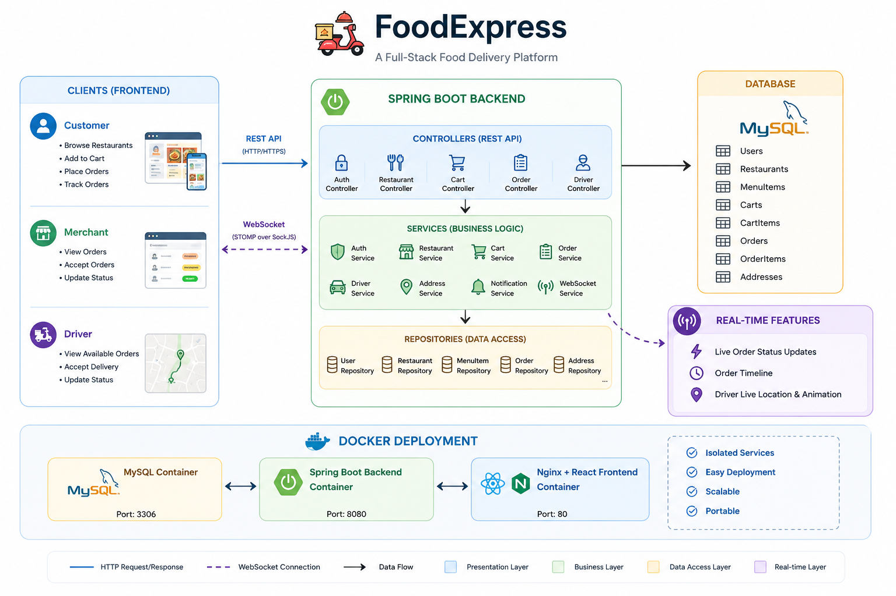
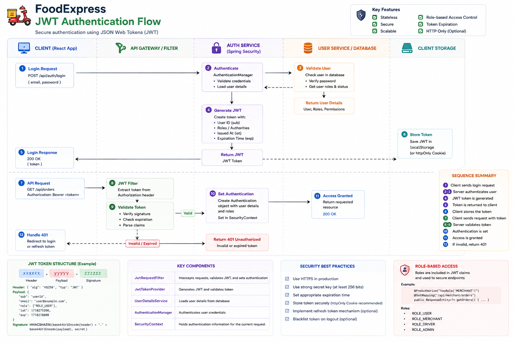
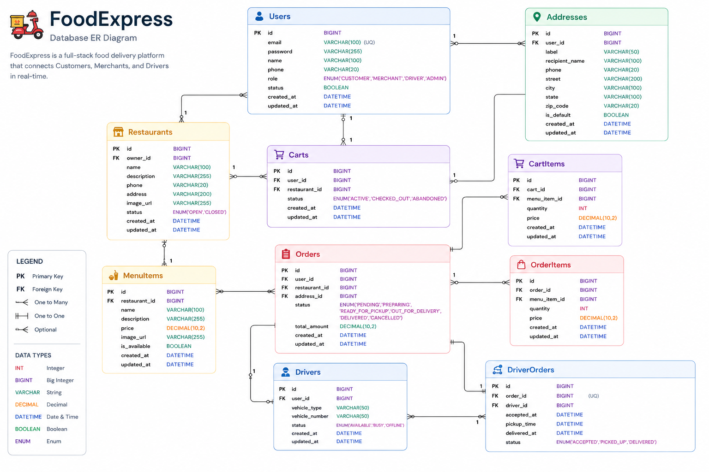
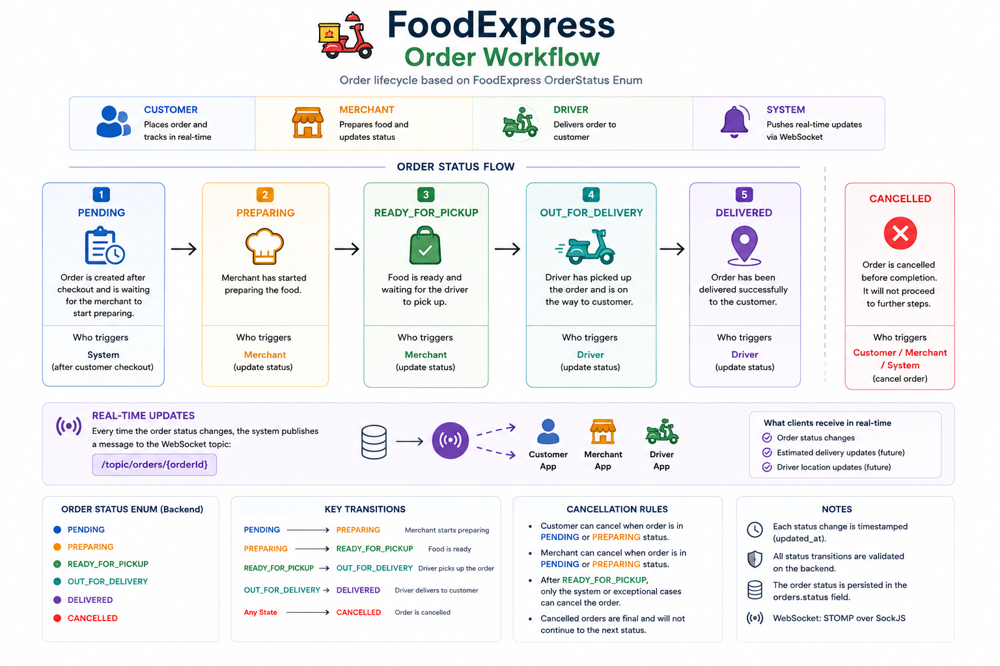
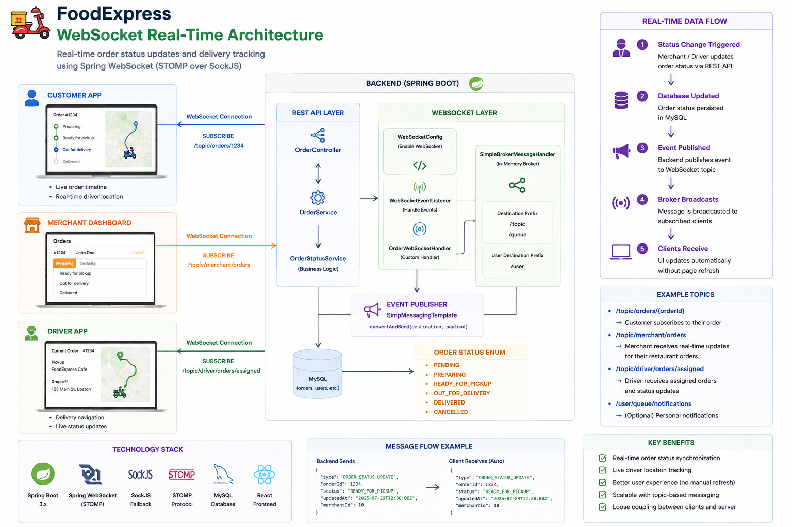

# 🍔 FoodExpress


A production-style full-stack food delivery platform inspired by **Uber Eats**.

FoodExpress provides a complete end-to-end food ordering experience, including customer ordering, merchant order management, driver delivery workflow, real-time order tracking, and live delivery visualization.

The project demonstrates production-oriented software engineering practices, including secure authentication, role-based authorization, real-time communication, layered architecture, and containerized deployment.

Built with **Java 21**, **Spring Boot**, **React**, **MySQL**, **Spring WebSocket**, and **Docker Compose**.

---

# 📑 Table of Contents

- [📐 System Architecture](#-system-architecture)
- [🚀 Overview](#-overview)
- [👤 Demo Accounts](#-demo-accounts)
- [✨ Features](#-features)
- [🛠 Tech Stack](#-tech-stack)
- [🔐 JWT Authentication](#-jwt-authentication)
- [📂 Project Structure](#-project-structure)
- [🌐 REST API](#-rest-api)
- [🗄 Database Design](#-database-design)
- [🔄 Order Workflow](#-order-workflow)
- [📡 Real-Time Order Tracking](#-real-time-order-tracking)
- [🐳 Docker Deployment](#-docker-deployment)
- [💻 Local Development](#-local-development)
- [📸 Screenshots](#-screenshots)
- [🚀 Future Improvements](#-future-improvements)
- [⭐ Highlights](#-highlights)
- [📄 License](#-license)

---

# 📐 System Architecture

<p align="center">
    
</p>

FoodExpress follows a layered full-stack architecture.

The React frontend communicates with the Spring Boot backend through REST APIs and WebSocket connections. Business logic is organized using Controller-Service-Repository layers, while MySQL persists application data. Docker Compose orchestrates the entire application stack for consistent deployment.

---

# 🚀 Overview

FoodExpress is a production-oriented food delivery platform designed to demonstrate modern full-stack software engineering practices.

Unlike a traditional CRUD application, FoodExpress models the complete food delivery ecosystem with three independent user roles:

- Customer
- Merchant
- Driver

The application implements the complete delivery lifecycle from restaurant browsing to real-time delivery tracking.

Core engineering highlights include:

- Layered Spring Boot Architecture
- JWT Authentication
- Role-Based Authorization
- RESTful API Design
- WebSocket Real-Time Communication
- Interactive Delivery Tracking
- Dockerized Deployment
- Clean Project Structure
- Production-Oriented Engineering Practices

---

# 👤 Demo Accounts

The following demo accounts are automatically initialized through **data.sql** during application startup.

| Role | Email | Password |
|------|-------|----------|
| Customer | day9test@example.com | password123 |
| Merchant | merchant@example.com | password123 |
| Driver | driver@example.com | password123 |

---

# ✨ Features

## Customer

- Secure JWT Authentication
- Browse Restaurants
- Restaurant Detail Page
- Browse Menu Items
- Shopping Cart
- Address Management
- Checkout
- Order History
- Order Details
- Live Order Timeline
- Real-Time Order Tracking
- Animated Delivery Map

---

## Merchant

- Merchant Authentication
- View Restaurant Orders
- Accept Orders
- Update Order Status
- Real-Time Customer Notification

---

## Driver

- View Available Deliveries
- Accept Assigned Orders
- Update Delivery Status
- Live Delivery Tracking

---

## System

- RESTful APIs
- JWT Authentication
- Spring Security
- Role-Based Authorization
- Global Exception Handling
- WebSocket Notifications
- Docker Deployment

---

# 🛠 Tech Stack

## Backend

- Java 21
- Spring Boot
- Spring Security
- JWT Authentication
- Spring Data JPA
- Hibernate
- MySQL
- Spring WebSocket
- STOMP
- SockJS
- Maven

---

## Frontend

- React
- React Router
- Axios
- Leaflet
- CSS3

---

## DevOps

- Docker
- Docker Compose
- Nginx

---

## Development Tools

- Git
- GitHub
- IntelliJ IDEA
- VS Code
- Postman

---

# 🔐 JWT Authentication

FoodExpress secures all protected APIs using **Spring Security** and **JSON Web Tokens (JWT)**.

After successful authentication, the backend generates a signed JWT containing the user's identity and role. The client stores the token locally and automatically attaches it to every protected request using the `Authorization: Bearer <token>` header.

Incoming requests are intercepted by the JWT authentication filter. The token is validated, the user identity is restored, and access is granted according to the user's role.

<p align="center">
    
</p>

## Authentication Process

1. User submits login credentials.
2. Spring Security authenticates the request.
3. A signed JWT is generated.
4. The client stores the JWT.
5. Every protected request includes the JWT in the Authorization header.
6. Spring Security validates the JWT.
7. Access is granted according to the authenticated user's role.

## Security Features

- Spring Security
- JWT Authentication
- BCrypt Password Hashing
- Stateless Authentication
- Authentication Filter
- Role-Based Authorization

---

# 📂 Project Structure

```text
FoodExpress
│
├── backend
│   ├── src/main/java
│   │   ├── controller
│   │   ├── service
│   │   ├── repository
│   │   ├── entity
│   │   ├── dto
│   │   ├── security
│   │   ├── websocket
│   │   ├── config
│   │   ├── exception
│   │   └── FoodExpressApplication.java
│   │
│   └── src/main/resources
│       ├── application.properties
│       └── data.sql
│
├── frontend
│   ├── src
│   │   ├── api
│   │   ├── components
│   │   ├── pages
│   │   ├── services
│   │   ├── hooks
│   │   ├── websocket
│   │   └── styles
│   │
│   ├── Dockerfile
│   └── nginx.conf
│
├── docs
│   ├── architecture.png
│   ├── jwt-authentication-flow.png
│   ├── er-diagram.png
│   ├── order-workflow.png
│   ├── websocket-architecture.png
│   └── screenshots
│
├── docker-compose.yml
└── README.md
```

---

# 🌐 REST API

FoodExpress exposes RESTful APIs for customers, merchants, and drivers.

All protected endpoints require a valid **JWT Bearer Token**.

---

## Authentication

```http
POST /api/auth/register
POST /api/auth/login
```

---

## Restaurants

```http
GET /api/restaurants
GET /api/restaurants/{id}
```

---

## Cart

```http
GET    /api/cart
POST   /api/cart/items
PUT    /api/cart/items/{id}
DELETE /api/cart/items/{id}
```

---

## Address

```http
GET    /api/addresses
POST   /api/addresses
PUT    /api/addresses/{id}
DELETE /api/addresses/{id}
PUT    /api/addresses/{id}/default
```

---

## Orders

```http
POST /api/orders
GET  /api/orders/history
GET  /api/orders/{id}
```

---

## Merchant

```http
GET /api/merchant/orders
PUT /api/merchant/orders/{id}/status
```

---

## Driver

```http
GET /api/driver/orders
PUT /api/driver/orders/{id}/accept
PUT /api/driver/orders/{id}/status
```

---

# 🗄 Database Design

FoodExpress uses a normalized relational database designed around the core business entities involved in food ordering, merchant operations, and delivery management.

The schema emphasizes maintainability, scalability, and clear relationships between users, restaurants, menus, carts, and orders.

<p align="center">
    
</p>

## Main Entities

- Users
- Restaurants
- MenuItems
- Cart
- CartItems
- Orders
- OrderItems
- Addresses

### Design Highlights

- One customer can create multiple orders.
- Each restaurant owns multiple menu items.
- A shopping cart belongs to a single customer.
- Order items preserve menu snapshots at checkout.
- Driver assignments are associated directly with orders.
- User roles (Customer / Merchant / Driver) are managed through role-based authorization.

---

# 🔄 Order Workflow

The following diagram illustrates the complete order lifecycle implemented in FoodExpress.

<p align="center">
    
</p>

```text
PENDING
      │
      ▼
PREPARING
      │
      ▼
READY_FOR_PICKUP
      │
      ▼
OUT_FOR_DELIVERY
      │
      ▼
DELIVERED

      │
      └────────────► CANCELLED
```

Each state transition is validated by the backend before persistence.

Whenever the order status changes, Spring WebSocket immediately synchronizes the update to subscribed clients without requiring a page refresh.

---

# 📡 Real-Time Order Tracking

FoodExpress uses **Spring WebSocket (STOMP over SockJS)** to synchronize order updates between customers, merchants, and drivers in real time.

Whenever a merchant or driver changes an order status through a REST API, the backend updates the database, publishes a WebSocket event, and broadcasts the latest order information to subscribed clients.

React automatically refreshes the Order Timeline and Delivery Tracking Map without requiring any manual refresh.

<p align="center">
    
</p>

## Publish / Subscribe Topics

| Topic | Description |
|--------|-------------|
| `/topic/orders/{orderId}` | Customer subscribes to updates for a specific order |
| `/topic/merchant/orders` | Merchant receives restaurant order updates |
| `/topic/driver/orders/assigned` | Driver receives assigned deliveries |

## Technology Stack

- Spring WebSocket
- STOMP Protocol
- SockJS
- SimpMessagingTemplate
- Topic-based Publish / Subscribe
- Automatic React State Updates
- Live Order Timeline
- Delivery Tracking Animation

## Benefits

- Instant order status synchronization
- No browser refresh required
- Loose coupling between backend and frontend
- Efficient event-driven communication
- Improved customer experience
- Scalable publish/subscribe architecture

---

# 🐳 Docker Deployment

FoodExpress is fully containerized using **Docker Compose**.

The entire application stack, including the frontend, backend, and database, can be started with a single command.

```bash
docker compose up --build
```

---

## Docker Services

| Service | Description | Port |
|----------|-------------|------|
| React + Nginx | Frontend Application | 80 |
| Spring Boot | Backend REST API & WebSocket | 8080 |
| MySQL 8.4 | Relational Database | 3307 |

---

## Container Architecture

```text
                Docker Compose
                      │
        ┌─────────────┼──────────────┐
        ▼             ▼              ▼
   React + Nginx   Spring Boot     MySQL
        │              │              │
        └──────────────┴──────────────┘
                    Internal Network
```

---

## Build Images

```bash
docker compose build
```

---

## Start Containers

```bash
docker compose up
```

---

## Run in Detached Mode

```bash
docker compose up -d
```

---

## Stop Containers

```bash
docker compose down
```

---

## Remove Containers and Volumes

```bash
docker compose down -v
```

---

# 💻 Local Development

## Requirements

- Java 21
- Node.js 20+
- Maven 3.9+
- MySQL 8.x
- Docker Desktop (Optional)
- Git

---

## Clone Repository

```bash
git clone https://github.com/your-username/FoodExpress.git

cd FoodExpress
```

---

## Backend

```bash
cd backend

mvn spring-boot:run
```

Backend runs at

```
http://localhost:8080
```

---

## Frontend

```bash
cd frontend

npm install

npm run dev
```

Frontend runs at

```
http://localhost:5173
```

---

## Docker

```bash
docker compose up --build
```

Application

```
Frontend
http://localhost

Backend
http://localhost:8080
```

---

# 📸 Screenshots

## Login

<p align="center">
    
</p>

---

## Home Page

<p align="center">
    
</p>

---

## Restaurant Details

<p align="center">
    
</p>

---

## Shopping Cart

<p align="center">
    
</p>

---

## Checkout

<p align="center">
    
</p>

---

## Order History

<p align="center">
    
</p>

---

## Order Timeline

<p align="center">
    
</p>

---

## Merchant Dashboard

<p align="center">
    
</p>

---

## Driver Dashboard

<p align="center">
    
</p>

---

## Delivery Tracking Map

<p align="center">
    
</p>

---

# 🚀 Future Improvements

Although FoodExpress already demonstrates a production-style food delivery workflow, several enhancements can further improve scalability and user experience.

## Product Features

- Stripe Payment Integration
- Apple Pay / Google Pay
- Push Notifications
- Email Notifications
- Order Rating & Reviews
- Coupon & Promotion System
- Favorite Restaurants
- Restaurant Search
- Order Scheduling
- Estimated Delivery Time Prediction

---

## Infrastructure

- Redis Cache
- GitHub Actions CI/CD
- Kubernetes Deployment
- AWS ECS / EKS Deployment
- Prometheus Monitoring
- Grafana Dashboard
- Centralized Logging
- Distributed Tracing
- API Gateway
- Microservice Migration

---

# ⭐ Highlights

FoodExpress demonstrates production-oriented software engineering practices rather than a traditional CRUD application.

### Backend

- Layered Spring Boot Architecture
- Clean Service-Oriented Design
- Spring Security
- JWT Authentication
- Role-Based Authorization
- RESTful API Design
- Global Exception Handling
- JPA / Hibernate
- Optimistic Locking
- DTO-Based API Design

---

### Frontend

- React 18
- React Router
- Axios
- Responsive UI
- Reusable Components
- Interactive Delivery Tracking
- Live Order Timeline

---

### Real-Time Communication

- Spring WebSocket
- STOMP Protocol
- SockJS
- Publish / Subscribe Messaging
- Automatic UI Synchronization

---

### Engineering

- Docker Compose Deployment
- MySQL Persistence
- Production Project Structure
- Modular Architecture
- Clean Code
- Maintainable Design

---

# 📄 License

This project is released under the MIT License.

Feel free to use, modify, and learn from this project for educational purposes.

---

## ⭐ If you find this project helpful, please consider giving it a Star!

Thank you for checking out **FoodExpress**.